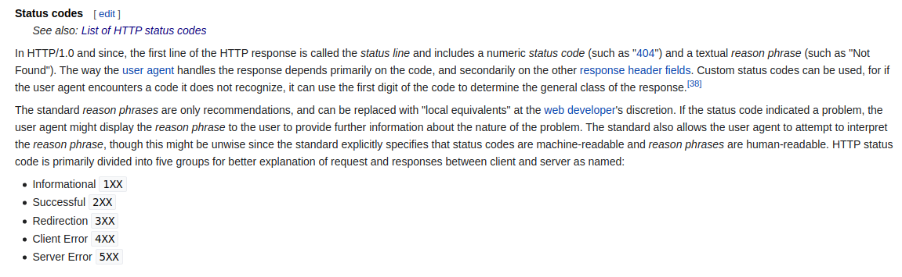

# Proyecto guiado - express yourself

## Objetivos

- Implementar un servidor web con express.

- Este proyecto guiado tiene como objetivo aprender a constuir una **api web**, con express que permita a los usuarios, realizar las operaciones **crud** las cuales son :
crear, recuperar, actualizar y eliminar de data, a través de una aplicación web.


## Siguientes pasos

- Implementar variables de entorno

## Aprendizajes sobre el proyecto

- Cuando el servidor express está escuhando puede responder todas y cada una de las solicitudes.
- Para que el servidor sepa cómo responder a cada solicitud debe tener una guía o **ruta**
- Las rutas definen el **flujo de control** para las solicitudes que vienen del cliente (navegador web)
- Las solicitudes se manejan en el servidor según la ruta y el verbo http

- HTTP sigue un ciclo de 1 solicitud y 1 respuesta, es decir, cada cliente espera exactamente una respuesta por solicitud,  y cada servidor debe enviar una única respuesta al cliente por cada solicitud que este le haga.
- Express busca a través de las rutas en el orden en que están registradas en tu código. Utiliza el primerro que coincida y se llamará a su función de callback.

```js
  cliente
  request get('/expressions')

  1.- app.get('/anothe-route', (req, res, next) => {
    //Manejador de la ruta
  })

  2.- app.get('/expressions', (req, res, next) => {
    res.send();  //sends response
  })

pasa primero por 1, pero como el `path: /expressions` no coincide, 
salta al 2, como el path solicitado coincide con  2, se invoca a la función de callback 
y se envía la respuesta que en ella esté indicada.
Si no hay rutas coincidentes registradas o el servidor express no ha enviado una
respuesta al final de todas las rutas coincidentes, enviará automaticamente una
respuesta `404 not found`

```

- Las rutas se vuelven más poderosas cuando pueden ser utilizadas de manera dinámica. El servidor
de express provee esta funcionalidad llamada `route parameters`

- Los parámetros son segmentos de ruta que empiezan con (:), por ejemplo, `/expression/:id`, puedes acceder al valor a través del objeto `req.params`

```js
A) cliente request: get('/expressions/1') 

app.get('/expressions/:id', (req, res, next) => {
  console.log(req.params) // {id: 1}
})

B) cliente request: get('/expressions/1/happy') 

app.get('/expressions/:id/:name', (req, res, next) => {
  console.log(req.params) // {id: 1, name: happy}
})

```

- Express nos permite establecer el `código de estado http` antes de que se envíe, estos códigos de respuesta, brindan información a los clientes sobre cómo se manejan sus solicitudes. Por default, cualquier `res.send()` envía por defecto el código de estado `200`

- El objeto `res` tiene el método `.status()` que te permite configurar el código de estado y otros 
métodos como `.send()` pueden ser encadenados desde ahí

```js
const monsterStoreInventory = { fenrirs: 4, banshees: 1, jerseyDevils: 4, krakens: 3 };

app.get('/monsters-inventory/:name', (req, res, next) => {
  const monsterInventory = monsterStoreInventory[req.params.name];
  if (monsterInventory) {
    res.send(monsterInventory);
  } else {
    res.status(404).send('Monster not found');
  }
});
```
- Los paŕametros son extremadamente útiles para hacer que las rutas del servidor
sean dinámicas y capaces de responder a diferentes entradas.

- Recuerda que para que una solicitud sea respondida por el servidor, la ruta debe coincidir
completamente con el path definido

```js
cliente : request('/expressions/1')

1.- app.get('/expressions', (req, res, next) => {
  res.send(getAllExpressions());
})

2.- app.get('/expressions/:id', (req, res, next) => {
  const expresion = getExpressionById(req.params.id) 
  res.send(expresion); // se envía la respuesta
})

Primero pasa por 1 y como la ruta no coincide con el path, salta al 2, 
como coincide la ruta con el path, se invoca a la función de callback que maneja a esa ruta.

```

- Express te permite trabajar con otros métodos http, como `POST`, `PUT/PATCH`, `DELETE` de la siguiente manera : `app.post(), app.puth(), app.patch(), app.delete()`

- Las peticiones del tipo `put` son utilizadas para actualizar un recurso existente. 

- Podemos hacer aún más interesantes nuestras rutas utilizando **query string**. Lo que me permite
envíar más información al momento que el cliente realiza una petición. Suelen aparecer al final del la `url` y son los que aparecen luego del caracter `?`

```js
  const ruta = 'http://localhost:4000/expressions/1?name=lulu&age=12'
  `query string` : 'name=lulu&age=12'
  `path` : '/expressions/1'
  `parametro` : 1
```
- Los `query string` no cuentan como parte de la ruta. El servidor express lo analiza en un objeto javascript y lo adjunta al cuerpo de la solicitud en el objeto `req.query`


- El método del tipo `post` nos permite crear un nuevo elemento en la base de datos. Por lo tanto 
al momento de hacer el request tendremos que envíar los datos que queremos que tenga este nuevo recurso, para ello nos volveremos a apoyar del `query string`

- El método `delete` es utilizado para eliminar recursos. Si queremos utilizarlo debemos indicar qué recurso quiero eliminar e identificarlo de manera única. Al terminar con esta operación el servidor suele enviar el código `204 - no content` si la eliminación ocurrio sin errores 


```js
 const ruta = 'http://localhost:4000/expressions/1?name=lulu&age=12'
 console.log(req.query)  //{name: 'lulu', age: 12}
```

### Correlación entre ruta y verbo http

- uri : `http://localhost:4000/`
- hostname : `localhost`
- port : `4000`


| Ruta                                        | http                                   |
| ------------------------------------------- | -------------------------------------- |
|`http://localhost:4000/expressions/`         | GET: recuperar todas las expresiones   |
|`http://localhost:4000/expressions/:id`      | GET: recupera expresion por id         |


### Códigos de estados http

