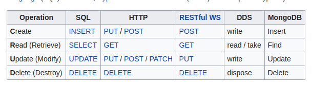

# Proyecto guiado - express yourself

## Objetivos

- Implementar un servidor web con express.

- Este proyecto guiado tiene como objetivo aprender a constuir una **api web**, con express que permita a los usuarios, realizar las operaciones **crud** las cuales son :
crear, recuperar, actualizar y eliminar de data, a través de una aplicación web.

## Siguientes pasos

- Implementar variables de entorno

## Aprendizajes sobre el proyecto

- Cuando el servidor express está escuhando puede responder todas y cada una de las solicitudes.
- Para que el servidor sepa cómo responder a cada solicitud debe tener una guía o **ruta**
- Las rutas definen el **flujo de control** para las solicitudes que vienen del cliente (navegador web)
- Las solicitudes se manejan en el servidor según la ruta y el verbo http

- HTTP sigue un ciclo de 1 solicitud y 1 respuesta, es decir, cada cliente espera exactamente una respuesta por solicitud,  y cada servidor debe enviar una única respuesta al cliente por cada solicitud que este le haga.

### Correlación entre ruta y verbo http

- uri : `http://localhost:4000/`
- hostname : `localhost`
- port : 4000

| Ruta                                        | http                                   |
| ------------------------------------------- | -------------------------------------- |
|`http://localhost:4000/expression`           | Get: recuperar todas las expresiones   |
| Campo A1                                    | Campo B1                               |